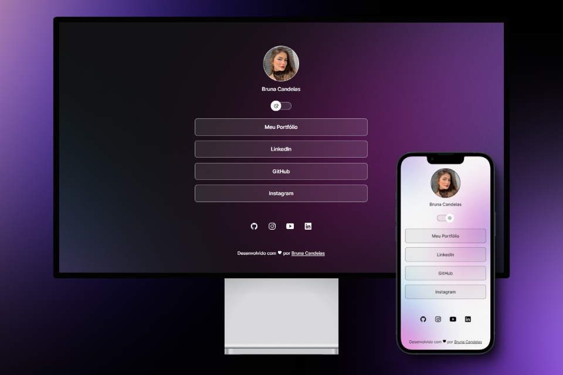

<h1 align="center">DevLinks</h1> 
  

  O DevLinks é um agregador de links, semelhante ao Link.tree, e é usado como um cartão de visitas online, agrupando inúmeros links em uma única URL.   Esse projeto foi proposto pelo curso Discover da <a href="https://www.rocketseat.com.br/">Rocketseat</a>, instruído pelo professor Mayk Brito.

### <a href="https://brunacostaz.github.io/DevLinks/" id="projeto"> 🖥️ Veja o projeto pronto aqui!</a>

## ⛏️ Tecnologias Utilizadas

* HTML e CSS
* JavaScript
* Git e GitHub
* Figma

## 🚀 Aprendizados

* Conceitos e práticas iniciais de responsividade
* Manipulação com CSS e JavaScript para a criação dos modos dark e light
* Utilizar o design idealizado no Figma para desenvolver a interface do projeto
